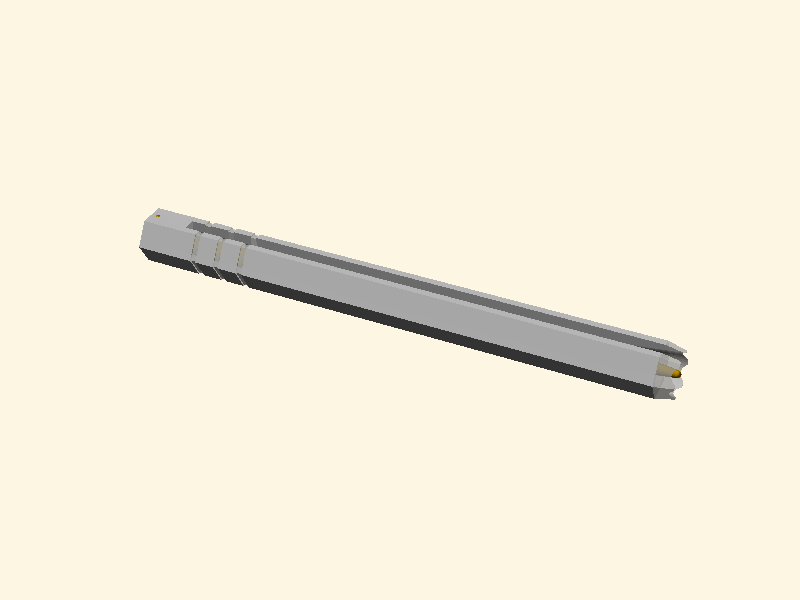
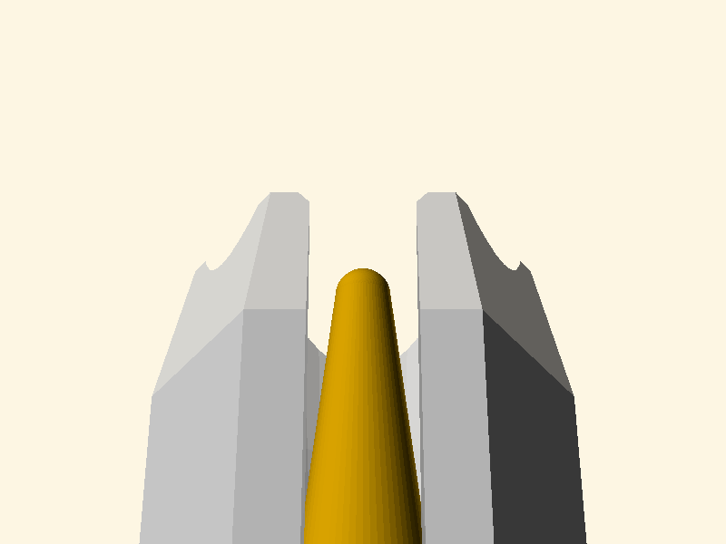
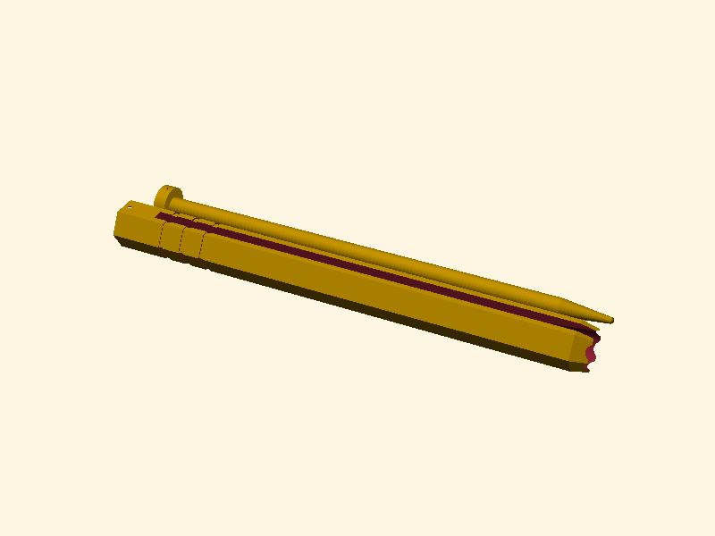

# Parametric Sliding Bag Sealer (OpenSCAD)

A highly durable, springless, two-piece sliding bag sealer (chip clip) designed in OpenSCAD. It is fully parameterized, optimized for 3D printing flat on the bed, and requires **no supports**.

## 🛠️ Key Design & Engineering Features

* **No Supports Required:** Both the hexagonal outer shell and the inner rod sit perfectly flat on the print bed.
* **Maximum Bending Strength:** By printing flat horizontally, the filament layer lines run along the length of the clip, ensuring it won't snap under stress from thick bags.
* **Co-Planar Flat Base:** A calculated flat-cut runs along the entire underside of both the rod and cap, providing a super-stable `3.88mm` flat footprint to guarantee excellent bed adhesion without rolling or warping.
* **Perfect Matching Half-Moon Joint:** The sleeve features a matching half-moon socket in the back, ensuring the rod cap sits 100% flush and solid when assembled.
* **Tactile Snap-Lock:** A small spherical snap bump on the rod cap clicks securely into a dimple in the shell's recess, keeping the rod locked captive inside the sleeve.
* **Entry Guide Funnel:** A generous `15mm` flared conical entry taper on the sleeve and a smooth tapered nose on the rod allow bag folds to slide in smoothly without snagging.

---

## 🖼️ Visual Renders

### 1. Assembled Fit
When inserted, the rod sits concentrically inside the sleeve, and the rod cap sits completely flush with the back face of the sleeve:


### 2. Front Guided Entrance
The flared entry taper on the sleeve and the guide nose on the rod form a wide guided funnel for smooth bag sliding:


### 3. Print Bed Layout
Both parts lie flat on the bed, ready to export and print with no supports and high strength:


---

## ⚙️ Customization

You can open `bag_clip.scad` in OpenSCAD and adjust these primary variables directly in the Editor or using the **Customizer Panel**:

```openscad
// Total length of the bag clip (mm)
clip_length = 150; 

// Diameter of the inner rod (mm)
rod_diameter = 5.5; 

// Clearance gap between the rod and the shell (Crucial for bag thickness)
gap_size = 1.2; 

// Width of the slot in the outer shell (mm)
slot_width = 3.5; 

// Fit clearance tolerance for the snap joint (mm)
snap_clearance = 0.15; 
```

### 💡 Recommended Gap Sizes:
* **Thin Bags** (e.g., bread bags, thin single-layer plastic): `gap_size = 0.8` to `1.0`
* **Medium Bags** (e.g., standard thick potato chip/snack bags): `gap_size = 1.1` to `1.3`
* **Thick Bags** (e.g., foil-lined coffee bags, pet food bags): `gap_size = 1.4` to `1.8`

---

## 🖨️ Recommended Print Settings (e.g., Bambu Lab X1C)

* **Material:** PLA or PETG (PETG is ideal for maximum springiness; PLA is perfect and rigid)
* **Layer Height:** `0.20mm` (Standard)
* **Wall Loops (Perimeters):** Set to **3 or 4 walls** (Highly recommended to make the shell robust and springy)
* **Infill:** `15%` to `20%` (Gyroid or Grid pattern)
* **Supports:** **Disabled** (Not required)
